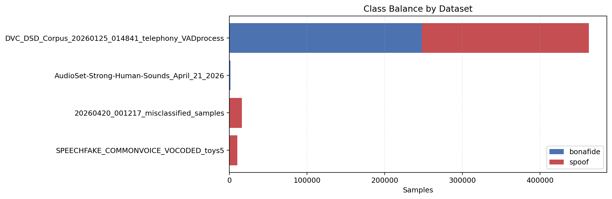
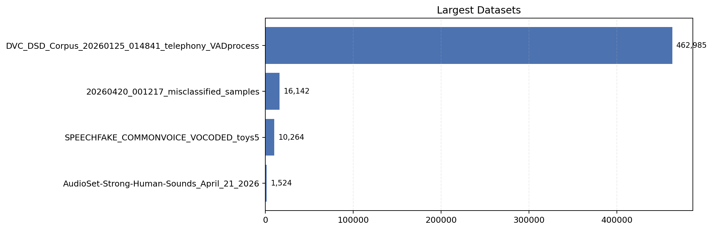
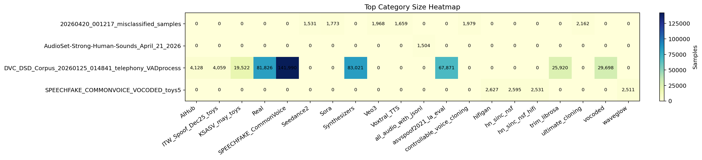
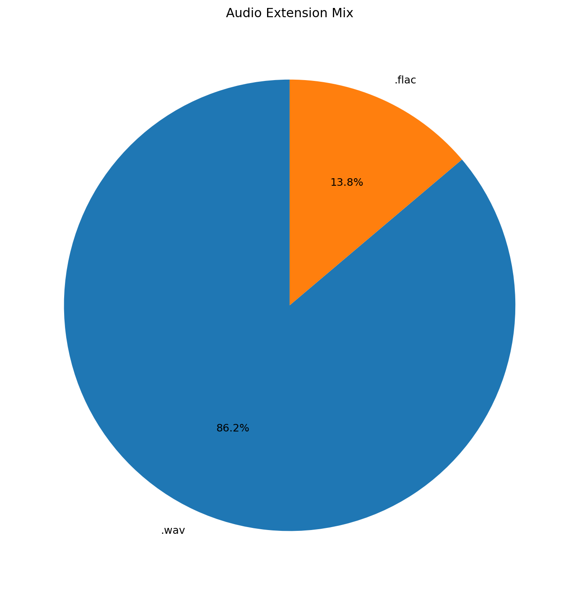

# Dataset Pool Analysis

- Generated at: `2026-04-24T11:39:51`
- Dataset root: `/data/Datasets/dsd_corpus_pool`
- Protocol files: `4`
- Total protocol rows: `490,915`
- Datasets: `4`
- Bonafide: `249,390`
- Spoof: `241,525`
- Duplicate relative paths: `0`

## Visualizations









## Dataset Summary

```
                                            dataset  samples  bonafide  spoof  subsets  categories  path_depth_min  path_depth_max  missing_checked
DVC_DSD_Corpus_20260125_014841_telephony_VADprocess   462985    247866 215119        3          15               2               9           162985
              20260420_001217_misclassified_samples    16142         0  16142        1         341               3               7                0
               SPEECHFAKE_COMMONVOICE_VOCODED_toys5    10264         0  10264        1           4               5               5                0
         AudioSet-Strong-Human-Sounds_April_21_2026     1524      1524      0        1           3               2               2                0
```

## Largest Categories Overall

```
                                            dataset category_type                   category  samples  bonafide  spoof
DVC_DSD_Corpus_20260125_014841_telephony_VADprocess      folder_1     SPEECHFAKE_CommonVoice   141990    141990      0
DVC_DSD_Corpus_20260125_014841_telephony_VADprocess      folder_1               Synthesizers    83021         0  83021
DVC_DSD_Corpus_20260125_014841_telephony_VADprocess      folder_1                       Real    81826     81826      0
DVC_DSD_Corpus_20260125_014841_telephony_VADprocess      folder_1       asvspoof2021_la_eval    67871      6791  61080
DVC_DSD_Corpus_20260125_014841_telephony_VADprocess      folder_1                    vocoded    29698         0  29698
DVC_DSD_Corpus_20260125_014841_telephony_VADprocess      folder_1               trim_librosa    25920     10996  14924
DVC_DSD_Corpus_20260125_014841_telephony_VADprocess      folder_1             KSASV_may_toys    19522      4607  14915
DVC_DSD_Corpus_20260125_014841_telephony_VADprocess      folder_1                      AIHub     4128         0   4128
DVC_DSD_Corpus_20260125_014841_telephony_VADprocess      folder_1       ITW_Spoof_Dec25_toys     4059         0   4059
               SPEECHFAKE_COMMONVOICE_VOCODED_toys5       vocoder                    hifigan     2627         0   2627
               SPEECHFAKE_COMMONVOICE_VOCODED_toys5       vocoder                hn_sinc_nsf     2595         0   2595
               SPEECHFAKE_COMMONVOICE_VOCODED_toys5       vocoder           hn_sinc_nsf_hifi     2531         0   2531
               SPEECHFAKE_COMMONVOICE_VOCODED_toys5       vocoder                   waveglow     2511         0   2511
              20260420_001217_misclassified_samples     generator           ultimate_cloning     2162         0   2162
              20260420_001217_misclassified_samples     generator controllable_voice_cloning     1979         0   1979
              20260420_001217_misclassified_samples     generator                       Veo3     1968         0   1968
              20260420_001217_misclassified_samples     generator                       Sora     1773         0   1773
              20260420_001217_misclassified_samples     generator                Voxtral_TTS     1659         0   1659
              20260420_001217_misclassified_samples     generator                  Seedance2     1531         0   1531
         AudioSet-Strong-Human-Sounds_April_21_2026    collection       all_audio_with_jsonl     1504      1504      0
```

## Extension Mix

```
  ext  samples
 .wav   423044
.flac    67871
```

## Per-Dataset Reports

- [20260420_001217_misclassified_samples](datasets/20260420_001217_misclassified_samples/report.md)
- [AudioSet-Strong-Human-Sounds_April_21_2026](datasets/audioset_strong_human_sounds_april_21_2026/report.md)
- [DVC_DSD_Corpus_20260125_014841_telephony_VADprocess](datasets/dvc_dsd_corpus_20260125_014841_telephony_vadprocess/report.md)
- [SPEECHFAKE_COMMONVOICE_VOCODED_toys5](datasets/speechfake_commonvoice_vocoded_toys5/report.md)
