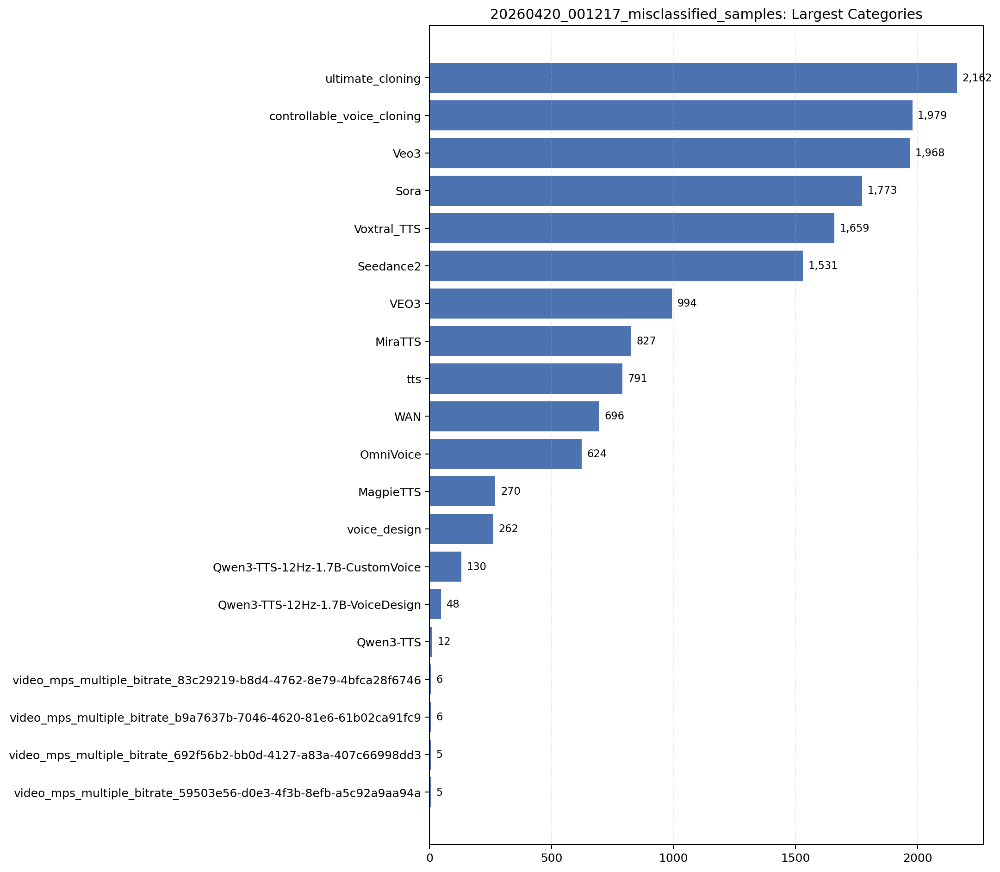
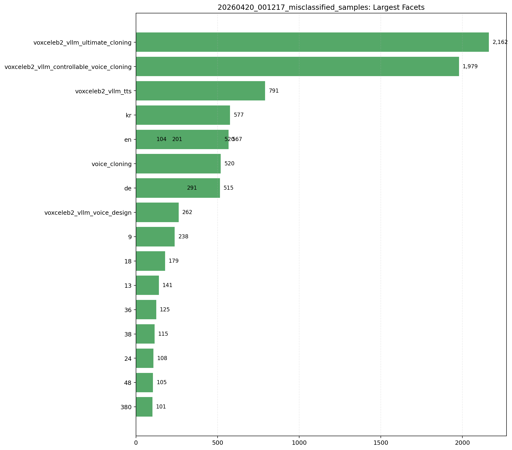

# 20260420_001217_misclassified_samples

- Samples: `16,142`
- Bonafide: `0`
- Spoof: `16,142`
- Subsets: `1`
- Categories: `341`
- Category rule: `generator` / `prompt_bucket`
- File-existence missing rate in checked rows: `0.00%`

## Visualizations





## Subsets

```
subset  samples
 train    16142
```

## Largest Categories

```
category_type                                                        category  samples  bonafide  spoof
    generator                                                ultimate_cloning     2162         0   2162
    generator                                      controllable_voice_cloning     1979         0   1979
    generator                                                            Veo3     1968         0   1968
    generator                                                            Sora     1773         0   1773
    generator                                                     Voxtral_TTS     1659         0   1659
    generator                                                       Seedance2     1531         0   1531
    generator                                                            VEO3      994         0    994
    generator                                                         MiraTTS      827         0    827
    generator                                                             tts      791         0    791
    generator                                                             WAN      696         0    696
    generator                                                       OmniVoice      624         0    624
    generator                                                       MagpieTTS      270         0    270
    generator                                                    voice_design      262         0    262
    generator                                 Qwen3-TTS-12Hz-1.7B-CustomVoice      130         0    130
    generator                                 Qwen3-TTS-12Hz-1.7B-VoiceDesign       48         0     48
    generator                                                       Qwen3-TTS       12         0     12
    generator video_mps_multiple_bitrate_83c29219-b8d4-4762-8e79-4bfca28f6746        6         0      6
    generator video_mps_multiple_bitrate_b9a7637b-7046-4620-81e6-61b02ca91fc9        6         0      6
    generator video_mps_multiple_bitrate_692f56b2-bb0d-4127-a83a-407c66998dd3        5         0      5
    generator video_mps_multiple_bitrate_59503e56-d0e3-4f3b-8efb-a5c92a9aa94a        5         0      5
```

## Largest Fine-Grained Facets

```
                       category    facet_type                                     facet  samples  bonafide  spoof
               ultimate_cloning prompt_bucket           voxceleb2_vllm_ultimate_cloning     2162         0   2162
     controllable_voice_cloning prompt_bucket voxceleb2_vllm_controllable_voice_cloning     1979         0   1979
                            tts prompt_bucket                        voxceleb2_vllm_tts      791         0    791
                    Voxtral_TTS prompt_bucket                                        kr      577         0    577
                    Voxtral_TTS prompt_bucket                                        en      567         0    567
                      OmniVoice prompt_bucket                             voice_cloning      520         0    520
                        MiraTTS prompt_bucket                                        en      520         0    520
                    Voxtral_TTS prompt_bucket                                        de      515         0    515
                        MiraTTS prompt_bucket                                        de      291         0    291
                   voice_design prompt_bucket               voxceleb2_vllm_voice_design      262         0    262
                           Sora prompt_bucket                                         9      238         0    238
                      MagpieTTS prompt_bucket                                        en      201         0    201
                           Sora prompt_bucket                                        18      179         0    179
                           Sora prompt_bucket                                        13      141         0    141
                           Veo3 prompt_bucket                                        36      125         0    125
                           Veo3 prompt_bucket                                        38      115         0    115
                           Sora prompt_bucket                                        24      108         0    108
                           Veo3 prompt_bucket                                        48      105         0    105
Qwen3-TTS-12Hz-1.7B-CustomVoice prompt_bucket                                        en      104         0    104
                            WAN prompt_bucket                                       380      101         0    101
```

## Sample Paths

```
2026_April_Dataset_processed/Seedance2/1/1_1/1_1_0.wav
2026_April_Dataset_processed/Seedance2/1/1_10/1_10_0.wav
2026_April_Dataset_processed/Seedance2/1/1_11/1_11_0.wav
2026_April_Dataset_processed/Seedance2/1/1_12/1_12_0.wav
2026_April_Dataset_processed/Seedance2/1/1_13/1_13_0.wav
2026_April_Dataset_processed/Seedance2/1/1_14/1_14_0.wav
2026_April_Dataset_processed/Seedance2/1/1_15/1_15_0.wav
2026_April_Dataset_processed/Seedance2/1/1_16/1_16_0.wav
```
