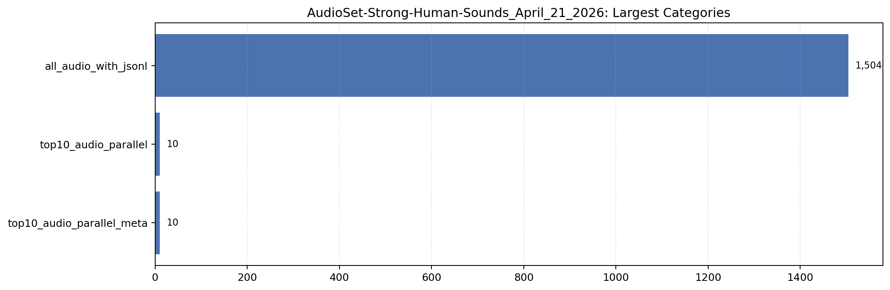
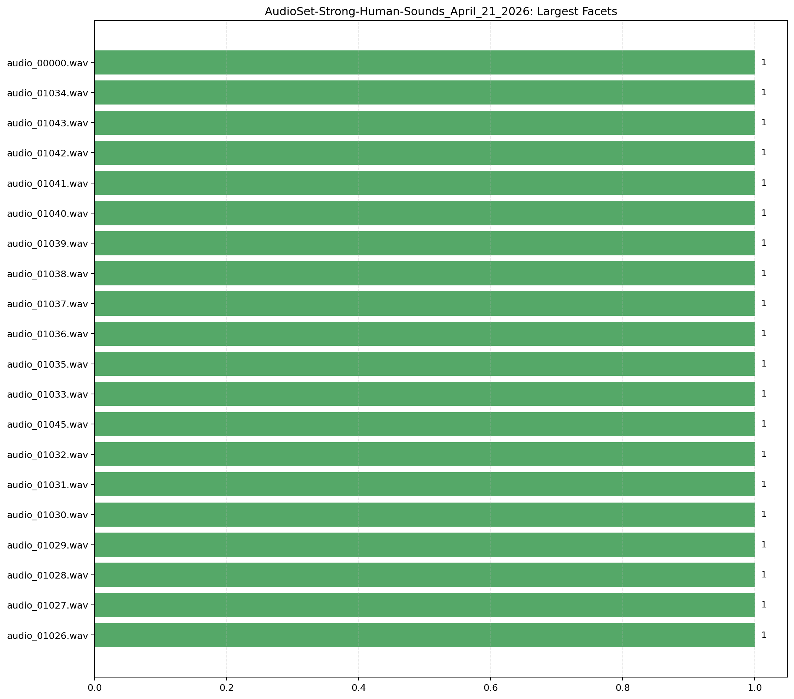

# AudioSet-Strong-Human-Sounds_April_21_2026

- Samples: `1,524`
- Bonafide: `1,524`
- Spoof: `0`
- Subsets: `1`
- Categories: `3`
- Category rule: `collection` / `folder`
- File-existence missing rate in checked rows: `0.00%`

## Visualizations





## Subsets

```
subset  samples
 train     1524
```

## Largest Categories

```
category_type                  category  samples  bonafide  spoof
   collection      all_audio_with_jsonl     1504      1504      0
   collection      top10_audio_parallel       10        10      0
   collection top10_audio_parallel_meta       10        10      0
```

## Largest Fine-Grained Facets

```
            category facet_type           facet  samples  bonafide  spoof
all_audio_with_jsonl     folder audio_00000.wav        1         1      0
all_audio_with_jsonl     folder audio_01034.wav        1         1      0
all_audio_with_jsonl     folder audio_01043.wav        1         1      0
all_audio_with_jsonl     folder audio_01042.wav        1         1      0
all_audio_with_jsonl     folder audio_01041.wav        1         1      0
all_audio_with_jsonl     folder audio_01040.wav        1         1      0
all_audio_with_jsonl     folder audio_01039.wav        1         1      0
all_audio_with_jsonl     folder audio_01038.wav        1         1      0
all_audio_with_jsonl     folder audio_01037.wav        1         1      0
all_audio_with_jsonl     folder audio_01036.wav        1         1      0
all_audio_with_jsonl     folder audio_01035.wav        1         1      0
all_audio_with_jsonl     folder audio_01033.wav        1         1      0
all_audio_with_jsonl     folder audio_01045.wav        1         1      0
all_audio_with_jsonl     folder audio_01032.wav        1         1      0
all_audio_with_jsonl     folder audio_01031.wav        1         1      0
all_audio_with_jsonl     folder audio_01030.wav        1         1      0
all_audio_with_jsonl     folder audio_01029.wav        1         1      0
all_audio_with_jsonl     folder audio_01028.wav        1         1      0
all_audio_with_jsonl     folder audio_01027.wav        1         1      0
all_audio_with_jsonl     folder audio_01026.wav        1         1      0
```

## Sample Paths

```
all_audio_with_jsonl/audio_00000.wav
all_audio_with_jsonl/audio_00001.wav
all_audio_with_jsonl/audio_00002.wav
all_audio_with_jsonl/audio_00003.wav
all_audio_with_jsonl/audio_00004.wav
all_audio_with_jsonl/audio_00005.wav
all_audio_with_jsonl/audio_00006.wav
all_audio_with_jsonl/audio_00007.wav
```
