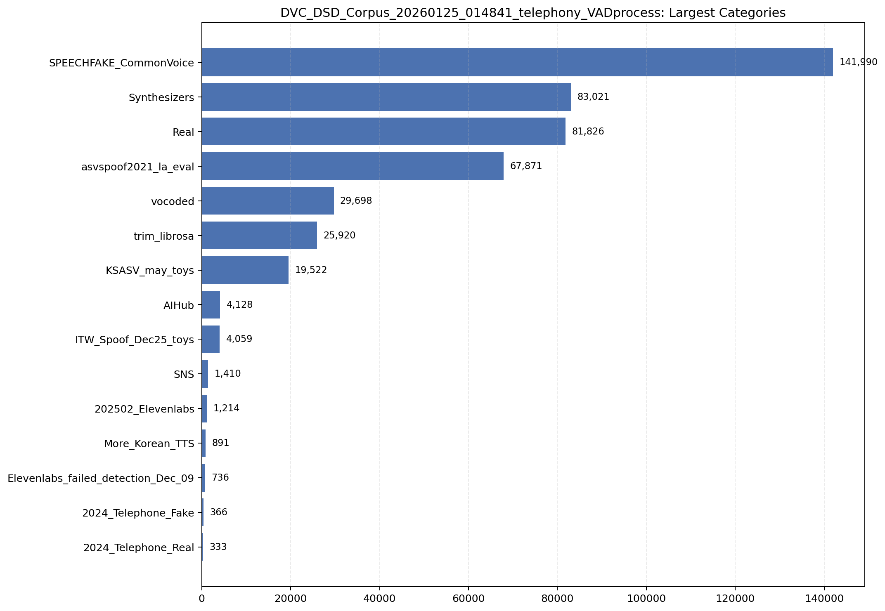
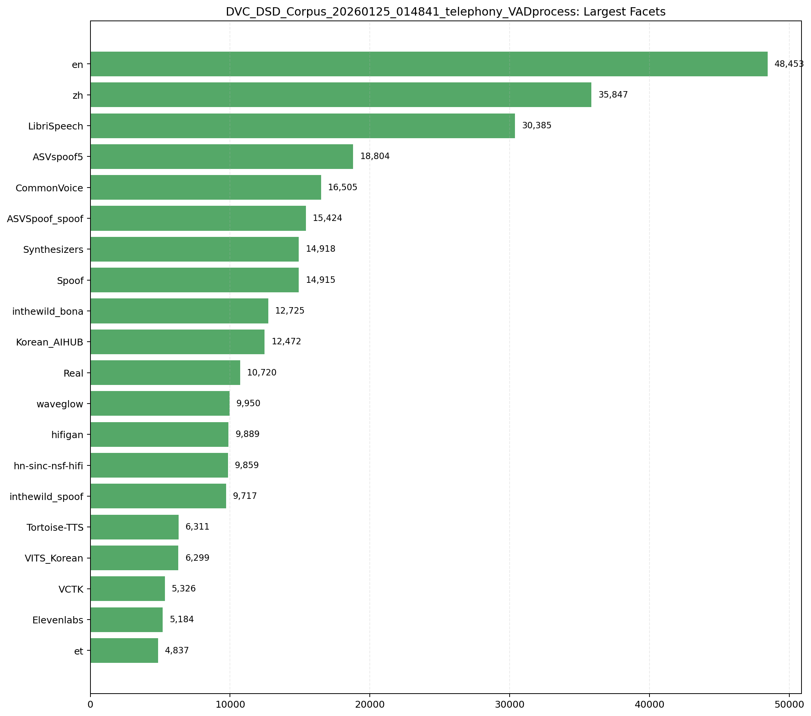

# DVC_DSD_Corpus_20260125_014841_telephony_VADprocess

- Samples: `462,985`
- Bonafide: `247,866`
- Spoof: `215,119`
- Subsets: `3`
- Categories: `15`
- Category rule: `folder_1` / `folder_2`
- File-existence missing rate in checked rows: `35.20%`

## Visualizations





## Subsets

```
subset  samples
 train   223569
  eval   158092
   dev    81324
```

## Largest Categories

```
category_type                           category  samples  bonafide  spoof
     folder_1             SPEECHFAKE_CommonVoice   141990    141990      0
     folder_1                       Synthesizers    83021         0  83021
     folder_1                               Real    81826     81826      0
     folder_1               asvspoof2021_la_eval    67871      6791  61080
     folder_1                            vocoded    29698         0  29698
     folder_1                       trim_librosa    25920     10996  14924
     folder_1                     KSASV_may_toys    19522      4607  14915
     folder_1                              AIHub     4128         0   4128
     folder_1               ITW_Spoof_Dec25_toys     4059         0   4059
     folder_1                                SNS     1410      1323     87
     folder_1                  202502_Elevenlabs     1214         0   1214
     folder_1                    More_Korean_TTS      891         0    891
     folder_1 Elevenlabs_failed_detection_Dec_09      736         0    736
     folder_1                2024_Telephone_Fake      366         0    366
     folder_1                2024_Telephone_Real      333       333      0
```

## Largest Fine-Grained Facets

```
              category facet_type            facet  samples  bonafide  spoof
SPEECHFAKE_CommonVoice   folder_2               en    48453     48453      0
SPEECHFAKE_CommonVoice   folder_2               zh    35847     35847      0
                  Real   folder_2      LibriSpeech    30385     30385      0
          Synthesizers   folder_2        ASVspoof5    18804         0  18804
                  Real   folder_2      CommonVoice    16505     16505      0
          Synthesizers   folder_2   ASVSpoof_spoof    15424         0  15424
          trim_librosa   folder_2     Synthesizers    14918         0  14918
        KSASV_may_toys   folder_2            Spoof    14915         0  14915
                  Real   folder_2   inthewild_bona    12725     12725      0
                  Real   folder_2     Korean_AIHUB    12472     12472      0
          trim_librosa   folder_2             Real    10720     10720      0
               vocoded   folder_2         waveglow     9950         0   9950
               vocoded   folder_2          hifigan     9889         0   9889
               vocoded   folder_2 hn-sinc-nsf-hifi     9859         0   9859
          Synthesizers   folder_2  inthewild_spoof     9717         0   9717
          Synthesizers   folder_2     Tortoise-TTS     6311         0   6311
          Synthesizers   folder_2      VITS_Korean     6299         0   6299
                  Real   folder_2             VCTK     5326      5326      0
          Synthesizers   folder_2       Elevenlabs     5184         0   5184
SPEECHFAKE_CommonVoice   folder_2               et     4837      4837      0
```

## Sample Paths

```
2024_Telephone_Real/LA_D_5623559_r0_s0_t1468-4790_len3322.wav
2024_Telephone_Real/LA_D_3892057_r0_s0_t860-3318_len2458.wav
2024_Telephone_Real/LA_T_5791737_r0_s0_t1116-3190_len2074.wav
2024_Telephone_Real/TOTLIV_INTERVIEW_6_r0_s0_t60-5686_len5626.wav
2024_Telephone_Real/07MHK00041_11896_r0_s0_t1724-5174_len3450.wav
2024_Telephone_Real/LA_D_7945965_r0_s0_t1244-4150_len2906.wav
2024_Telephone_Real/LA_T_3505297_r0_s0_t700-3030_len2330.wav
2024_Telephone_Real/LA_D_4224972_r0_s0_t1372-5302_len3930.wav
```
