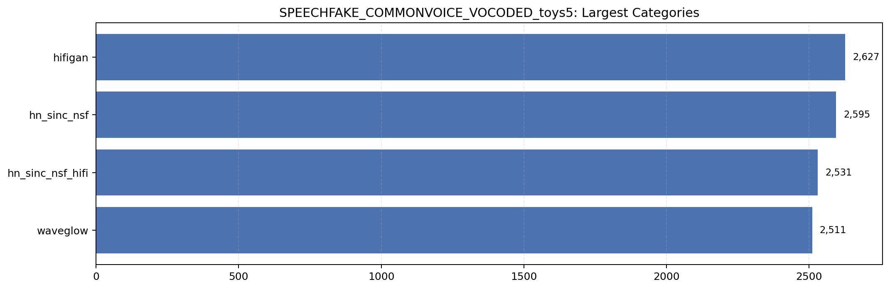
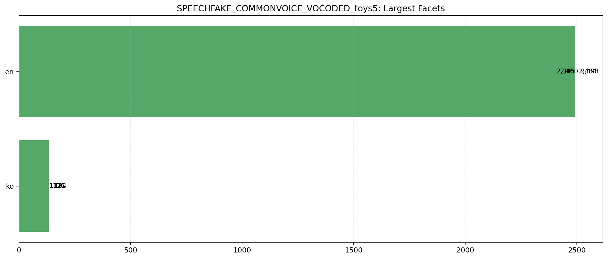

# SPEECHFAKE_COMMONVOICE_VOCODED_toys5

- Samples: `10,264`
- Bonafide: `0`
- Spoof: `10,264`
- Subsets: `1`
- Categories: `4`
- Category rule: `vocoder` / `language`
- File-existence missing rate in checked rows: `0.00%`

## Visualizations





## Subsets

```
subset  samples
 train    10264
```

## Largest Categories

```
category_type         category  samples  bonafide  spoof
      vocoder          hifigan     2627         0   2627
      vocoder      hn_sinc_nsf     2595         0   2595
      vocoder hn_sinc_nsf_hifi     2531         0   2531
      vocoder         waveglow     2511         0   2511
```

## Largest Fine-Grained Facets

```
        category facet_type facet  samples  bonafide  spoof
         hifigan   language    en     2493         0   2493
     hn_sinc_nsf   language    en     2484         0   2484
hn_sinc_nsf_hifi   language    en     2400         0   2400
        waveglow   language    en     2385         0   2385
         hifigan   language    ko      134         0    134
hn_sinc_nsf_hifi   language    ko      131         0    131
        waveglow   language    ko      126         0    126
     hn_sinc_nsf   language    ko      111         0    111
```

## Sample Paths

```
hifigan/en/test/en_test_0/common_voice_en_101044.wav
hifigan/en/test/en_test_0/common_voice_en_1027817.wav
hifigan/en/test/en_test_0/common_voice_en_103615.wav
hifigan/en/test/en_test_0/common_voice_en_10392.wav
hifigan/en/test/en_test_0/common_voice_en_10393.wav
hifigan/en/test/en_test_0/common_voice_en_105838.wav
hifigan/en/test/en_test_0/common_voice_en_106219.wav
hifigan/en/test/en_test_0/common_voice_en_106363.wav
```
